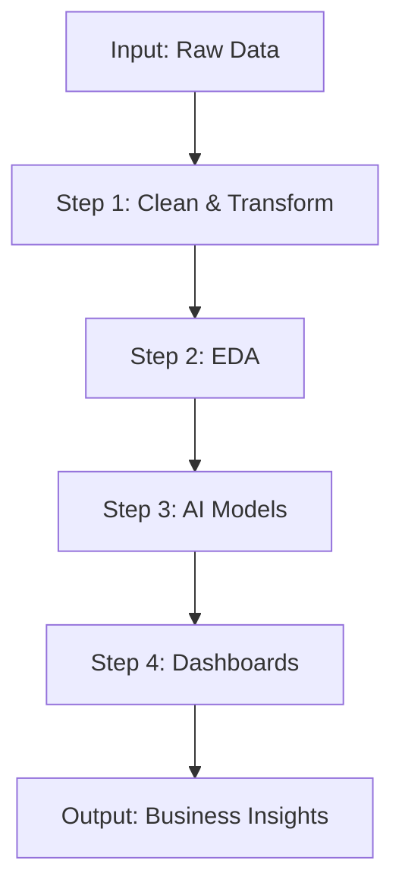

<!-- Futuristic, Clean & Robotic GitHub README for Anurag Pratap Singh -->

<h1 align="center">🤖 Anurag Pratap Singh</h1>
<h3 align="center">Data Analyst | MBA in Banking & Finance | BCA from VIT Vellore</h3>

  

  
  
  

---

## 🧬 About Me

🎓 I'm pursuing an **MBA in Banking & Finance (IGNOU - ODL)** and hold a **BCA from VIT Vellore** (Top 5%). I recently completed a **Data Analyst internship at Unified Mentor**.

🔍 I’m actively seeking data analyst opportunities where I can apply my skills in business intelligence, financial analysis, and automated insights to drive strategic decisions.

💡 Capable of building interactive dashboards, performing end-to-end data analysis, and turning raw data into stories that matter.

---

## 🚀 Portfolio Highlights

| Project | Description | Stack |
|--------|-------------|--------|
| **💳 Credit Card Fraud Detection** | Real-time risk flagging with ML and Django | Python, SQL |
| **🛒 Blinkit Sales Dashboard** | KPI-rich report with sentiment insights | Power BI |
| **📘 Academic AI Dashboard** | Risk prediction using Excel + Copilot | Excel, VBA |
| **🚖 Uber SQL Dashboard** | Route and fare trend analysis | SQL |
| **🧑‍💼 IBM HR Analytics** | Visual HR insights for attrition | Power BI |

---

## ⚙️ Technology Matrix

  

---

## 🧠 AI Workflow

---

## 📊 GitHub Stats

  
  

---

## 🌐 Connect with Me

  
  
  

  

  🤖 Coded for 2100. Runs on insights. Driven by chai.

---
