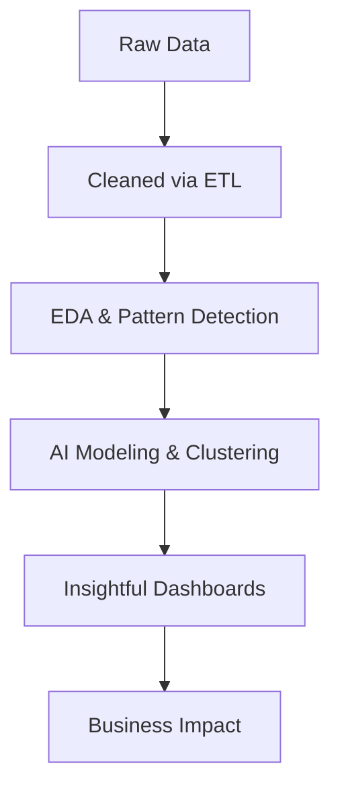

<!-- README.md for Anuraga123 - Professional & Futuristic Data Analyst GitHub Profile -->

<h1 align="center">Anurag Pratap Singh</h1>
<h3 align="center">Data Analyst | MBA (Banking & Finance) | VIT Vellore | Insight-Driven Professional</h3>

  

  
  

---

## 🧪 About Me

- 🎓 **BCA - VIT Vellore (Top 5%)**, CGPA 9.0
- 🎓 **MBA in Banking & Finance - IGNOU (ODL)**
- 💼 Data Analyst Intern at **Unified Mentor**
- 🏆 Class 10 (94.8%) - District Gold Medalist
- 🏆 Class 12 (89%) - Amar Ujala Gold Award
- 🚀 Focused on solving business problems using data, dashboards & AI insights

---

## 🚀 Featured Projects

| Project | Description | Tools |
|--------|-------------|--------|
| **Credit Card Fraud Detection** | Real-time fraud flagging using ML & Django | Python, SQL, Django |
| **Blinkit Sales Dashboard** | KPI-rich dashboard with AI sentiment | Power BI |
| **AI Academic Dashboard** | Smart Excel for student risk alerts | Excel, Power Query, VBA |
| **Uber SQL Dashboard** | Trip data analysis & aggregation logic | PostgreSQL, SQL |
| **IBM HR Analytics** | Attrition visual insights & HR advice | Power BI, Python |
| **Hospital Management System** | Admin panel & login control | PHP, MySQL |

---

## 🔌 Tech Stack

  

---

## 🧰 AI Workflow

---

## 📊 GitHub Analytics

  
  

---

## 🏆 Trophies

  

---

## 🌐 Let’s Connect

  
  

  

  🧠 Built with precision. Designed for impact. ☕ Fueled by chai.

---
